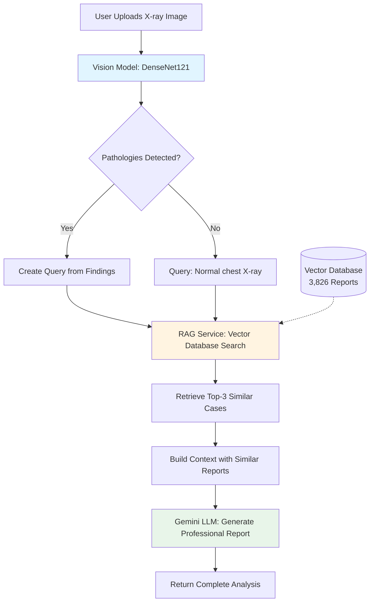

# Multimodal Radiological AI Assistant
## Technical Architecture & Data Flow Presentation

---

## 🎯 Project Overview

A **Retrieval-Augmented Generation (RAG)** system for automated chest X-ray analysis that combines:
- **Computer Vision** - Pathology detection using DenseNet121
- **Vector Database** - 3,826 medical reports indexed with LlamaIndex
- **Large Language Model** - Google Gemini for professional report generation

**Key Innovation**: Instead of relying solely on AI generation, the system retrieves similar historical cases to ground the LLM's responses in real medical data.

---

## 📊 System Architecture



---

## 🔧 Component Breakdown

### 1. Frontend (React + Vite)

**Location**: `frontend/src/`

**Key Features**:
- Image upload and preview
- Real-time analysis status
- Tabbed interface:
  - **Report Tab**: Structured findings and impressions
  - **Chat Tab**: Conversational Q&A about the case

**Tech Stack**:
- React 18 with functional components + hooks
- Tailwind CSS for styling
- Lucide React for icons

**Data Flow**:
```
User uploads image → POST /analyze → Display results
User asks question → POST /chat → Display response
```

---

### 2. Vision Service (DenseNet121)

**Location**: `backend/services/vision_service.py`

**Model**: `densenet121-res224-all` from TorchXRayVision

**Purpose**: Detect 18 different chest pathologies from X-ray images

**Pathologies Detected**:
- Cardiomegaly, Edema, Consolidation, Atelectasis
- Pneumonia, Pleural Thickening, Pneumothorax
- Effusion, Emphysema, Fibrosis, Mass, Nodule
- And 6 more conditions...

**Processing Pipeline**:
```python
1. Load image from disk
2. Normalize and resize to 224x224
3. Run through DenseNet121 CNN
4. Apply sigmoid to get probabilities
5. Filter by confidence threshold (>0.5)
6. Return sorted list of findings
```

**Output Example**:
```json
{
  "pathologies": [
    {"name": "Cardiomegaly", "confidence": 0.85},
    {"name": "Edema", "confidence": 0.72}
  ]
}
```

---

### 3. RAG Service (LlamaIndex + Vector Database)

**Location**: `backend/services/rag_service.py`

#### 3.1 Vector Database Creation (One-Time Setup)

**Data Source**: Indiana University Chest X-ray Dataset (Kaggle)
- **Total Reports**: 3,851
- **Valid Reports**: 3,826 (with findings/impression data)
- **Dataset Size**: 14 GB (original), 6.68 MB (vector DB compressed)

**Build Process** (in Kaggle Notebook):

```python
# Step 1: Download dataset
dataset = kagglehub.dataset_download("raddar/chest-xrays-indiana-university")

# Step 2: Load indiana_reports.csv
df = pd.read_csv("indiana_reports.csv")

# Step 3: Create LlamaIndex Documents
for report in df:
    doc = Document(
        text=f"Findings: {report.findings}\nImpression: {report.impression}",
        metadata={"report_id": idx, "source": "indiana_university"}
    )

# Step 4: Generate embeddings
embed_model = HuggingFaceEmbedding("sentence-transformers/all-MiniLM-L6-v2")
# Dimension: 384, Batch size: 10

# Step 5: Build vector index
index = VectorStoreIndex.from_documents(documents)

# Step 6: Persist to disk
index.storage_context.persist("faiss_storage/")
```

**Storage Format**:
```
faiss_index/storage/
├── default__vector_store.json  (33.8 MB - embeddings + FAISS index)
├── docstore.json               (5.9 MB - document texts)
├── index_store.json            (0.3 MB - index metadata)
└── graph_store.json            (18 bytes - graph data)
```

#### 3.2 Similarity Search (Runtime)

**Embedding Model**: `sentence-transformers/all-MiniLM-L6-v2`
- **Dimension**: 384
- **Speed**: Fast on CPU
- **Quality**: Good for medical text

**Search Algorithm**:
```python
# 1. Load persisted index from disk
storage_context = StorageContext.from_defaults(persist_dir="storage/")
index = load_index_from_storage(storage_context)

# 2. Create query from detected pathologies
query = "Cardiomegaly and Edema"  # Example

# 3. Embed query using same model
query_embedding = embed_model.encode(query)  # Shape: (384,)

# 4. Perform vector similarity search
retriever = index.as_retriever(similarity_top_k=3)
results = retriever.retrieve(query)

# 5. Return top-3 most similar reports with scores
```

**Similarity Metric**: Cosine similarity (normalized dot product)

**Output Example**:
```json
{
  "similar_cases": [
    {
      "rank": 1,
      "similarity": 0.682,
      "report": "Findings: Cardiomegaly...\nImpression: Increasing cardiomegaly with mild edema..."
    },
    {
      "rank": 2,
      "similarity": 0.629,
      "report": "Findings: Mild cardiomegaly...\nImpression: Compatible with mild edema..."
    }
  ]
}
```

---

### 4. LLM Service (Google Gemini)

**Location**: `backend/services/llm_service.py`

**Model**: `gemini-flash-latest` (via Google Generative AI API)

**API Configuration**:
- **Temperature**: 0.7 (balanced creativity/consistency)
- **Top-P**: 0.9 (nucleus sampling)
- **Max Tokens**: 1024

#### 4.1 Report Generation

**Input Construction**:
```python
prompt = f"""You are an expert radiologist writing a professional chest X-ray report.

**Detected Findings:**
Cardiomegaly (0.85), Edema (0.72)

**Similar Historical Cases for Reference:**
Case 1: Increasing cardiomegaly. No effusions. Minimal interstitial edema...
Case 2: Mild cardiomegaly with thin peripheral opacities compatible with mild edema...
Case 3: Cardiomegaly with interstitial edema. No effusions...

**Task:** Generate a structured radiology report with:
1. **FINDINGS**: Describe observed pathologies in detail
2. **IMPRESSION**: Provide clinical interpretation
3. **RECOMMENDATIONS**: Suggest follow-up actions if needed

Write in professional medical language. Be concise but thorough.
"""
```

**Output Format**:
```markdown
**FINDINGS:**
The chest X-ray demonstrates cardiomegaly with an enlarged cardiac silhouette. 
Interstitial edema is present with peripheral reticular opacities in the lung bases...

**IMPRESSION:**
1. Cardiomegaly with evidence of pulmonary edema
2. No pleural effusion or pneumothorax identified

**RECOMMENDATIONS:**
Clinical correlation is recommended. Consider follow-up imaging if symptoms persist.
```

#### 4.2 Conversational Chat

**Context Building**:
```python
system_context = """You are a medical AI assistant helping doctors understand radiology reports.

**Current Case:**
Detected: Cardiomegaly (0.85), Edema (0.72)
Generated Report: [Full report text...]

**Conversation History:**
[Last 6 messages...]
"""
```

**User Query** → **Gemini Response** (contextually aware)

---

## 🔄 Complete Data Flow

### End-to-End Request Processing

```
┌─────────────────────────────────────────────────────────────────────┐
│ 1. IMAGE UPLOAD                                                     │
│    Frontend → POST /analyze with multipart/form-data               │
└─────────────────────────────────────────────────────────────────────┘
                              ↓
┌─────────────────────────────────────────────────────────────────────┐
│ 2. VISION ANALYSIS (Step 1/3)                                       │
│    - Load image from upload                                          │
│    - Preprocess: resize, normalize                                   │
│    - DenseNet121 inference                                           │
│    - Filter by confidence > 0.5                                      │
│    - Output: List of pathologies with scores                        │
│    - Time: ~0.5-1.0 seconds                                          │
└─────────────────────────────────────────────────────────────────────┘
                              ↓
┌─────────────────────────────────────────────────────────────────────┐
│ 3. RAG RETRIEVAL (Step 2/3)                                         │
│    - Create query: Join top 3 pathology names                       │
│    - Load vector index from disk (cached in memory)                 │
│    - Embed query → 384-dim vector                                   │
│    - Cosine similarity search → Top 3 matches                       │
│    - Extract full report text from docstore                         │
│    - Time: ~0.3-0.5 seconds                                          │
└─────────────────────────────────────────────────────────────────────┘
                              ↓
┌─────────────────────────────────────────────────────────────────────┐
│ 4. REPORT GENERATION (Step 3/3)                                     │
│    - Build prompt with findings + similar cases                     │
│    - Call Gemini API with prompt                                    │
│    - Parse structured report from response                          │
│    - Time: ~1.0-2.0 seconds (depends on API)                        │
└─────────────────────────────────────────────────────────────────────┘
                              ↓
┌─────────────────────────────────────────────────────────────────────┐
│ 5. RESPONSE TO FRONTEND                                             │
│    JSON Response:                                                    │
│    {                                                                 │
│      "success": true,                                                │
│      "findings": [...],            // Vision results                │
│      "similar_cases": [...],       // RAG results                   │
│      "generated_report": "...",   // Gemini output                  │
│      "processing_time": 2.78       // Total seconds                 │
│    }                                                                 │
└─────────────────────────────────────────────────────────────────────┘
```

**Total Processing Time**: 2-4 seconds per image

---

## 📁 Project Structure

```
GenAI Project LLM+RAG/
│
├── frontend/                       # React Frontend
│   ├── src/
│   │   ├── components/
│   │   │   ├── ImageViewer.jsx    # X-ray display
│   │   │   ├── ReportTab.jsx      # Findings display
│   │   │   └── ChatTab.jsx        # Conversational interface
│   │   ├── App.jsx                # Main application
│   │   └── index.css              # Tailwind styles
│   └── package.json
│
├── backend/                        # FastAPI Backend
│   ├── services/
│   │   ├── vision_service.py      # DenseNet121 pathology detection
│   │   ├── rag_service.py         # LlamaIndex vector search
│   │   └── llm_service.py         # Gemini API integration
│   │
│   ├── scripts/
│   │   └── build_vector_db.py     # One-time DB builder (local)
│   │
│   ├── data/
│   │   └── faiss_index/storage/   # Persisted vector database
│   │       ├── default__vector_store.json
│   │       ├── docstore.json
│   │       ├── index_store.json
│   │       └── graph_store.json
│   │
│   ├── config.py                   # Centralized configuration
│   ├── main.py                     # FastAPI application
│   ├── requirements.txt
│   └── .env                        # API keys (not in git)
│
└── test images/                    # Sample X-ray images for testing
```

---

## 🔑 Key Technologies

### Backend Stack
- **Framework**: FastAPI 0.108+
- **Vision**: TorchXRayVision, PyTorch, DenseNet121
- **RAG**: LlamaIndex 0.10+, FAISS, HuggingFace Embeddings
- **LLM**: Google Generative AI SDK
- **Data**: Pandas, NumPy, Pillow

### Frontend Stack
- **Framework**: React 18 + Vite
- **Styling**: Tailwind CSS 3
- **Icons**: Lucide React
- **HTTP**: Fetch API

### Infrastructure
- **Vector Store**: FAISS (CPU-optimized)
- **Embeddings**: sentence-transformers/all-MiniLM-L6-v2
- **Dataset**: Indiana University Chest X-rays (Kaggle)

---

## ⚙️ Configuration

### Model Settings (`config.py`)

```python
MODEL_CONFIG = {
    "vision": {
        "model_name": "densenet121-res224-all",
        "confidence_threshold": 0.5
    },
    "rag": {
        "embedding_model": "sentence-transformers/all-MiniLM-L6-v2",
        "embed_batch_size": 10,
        "top_k": 3,
        "chunk_size": 512,
        "chunk_overlap": 50,
        "persist_dir": "data/faiss_index/storage"
    },
    "llm": {
        "provider": "gemini",
        "model_name": "gemini-flash-latest",
        "max_tokens": 1024,
        "temperature": 0.7,
        "top_p": 0.9
    }
}
```

### Environment Variables (`.env`)

```bash
# Google Gemini API Key
GEMINI_API_KEY=AIza...

# HuggingFace Cache (redirect to E: drive)
HF_HOME=E:/huggingface_cache
TRANSFORMERS_CACHE=E:/huggingface_cache
SENTENCE_TRANSFORMERS_HOME=E:/huggingface_cache
```

---

## 🚀 Deployment & Setup

### 1. Build Vector Database (One-Time)

**Option A: Kaggle Notebook** (Recommended - avoids 14GB download)
```python
# Run cells in Kaggle to:
# 1. Download dataset (14GB)
# 2. Parse 3,826 reports
# 3. Generate embeddings
# 4. Build vector index
# 5. Export 6.68 MB ZIP file
```

**Option B: Local Build**
```bash
cd backend
python scripts/build_vector_db.py
# Downloads 14GB dataset and builds locally
```

### 2. Install Dependencies

**Backend**:
```bash
cd backend
pip install -r requirements.txt
```

**Frontend**:
```bash
cd frontend
npm install
```

### 3. Configure API Keys

Create `backend/.env`:
```bash
GEMINI_API_KEY=your_key_here
```

### 4. Start Services

**Terminal 1 - Backend**:
```bash
cd backend
python main.py
# Runs on http://localhost:8000
```

**Terminal 2 - Frontend**:
```bash
cd frontend
npm run dev
# Runs on http://localhost:5173
```

---

## 📈 Performance Metrics

### Processing Speed
- **Vision Analysis**: 0.5-1.0 seconds
- **RAG Retrieval**: 0.3-0.5 seconds
- **Report Generation**: 1.0-2.0 seconds
- **Total End-to-End**: 2-4 seconds

### Database Stats
- **Total Reports**: 3,826
- **Vector Dimension**: 384
- **Storage Size**: 40 MB (uncompressed), 6.68 MB (compressed)
- **Search Algorithm**: Cosine similarity (FAISS IndexFlatIP)
- **Memory Usage**: ~100 MB RAM (vector index cached)

### Model Accuracy
- **DenseNet121**: Pre-trained on CheXpert dataset
- **Embedding Model**: Optimized for semantic text similarity
- **Gemini LLM**: State-of-the-art language understanding

---

## 🎓 Key Learnings & Best Practices

### 1. RAG Architecture Benefits
- **Grounded Responses**: LLM references real medical cases
- **Reduced Hallucination**: Similar cases provide factual context
- **Explainability**: Users can review retrieved cases

### 2. Vector Database Design
- **Chunk Size**: 512 characters balances context vs. granularity
- **Top-K**: 3 similar cases provide sufficient context without noise
- **Embedding Model**: Lightweight (384-dim) enables fast CPU inference

### 3. LLM Prompting Strategies
- **Structured Output**: Request specific sections (Findings, Impression, Recommendations)
- **Few-Shot Learning**: Include similar cases as examples
- **Professional Tone**: Explicitly request medical language

### 4. System Integration
- **Persistent Storage**: Vector DB built once, loaded at startup
- **Lazy Loading**: LLM initialized on first request to save memory
- **Error Handling**: Fallback reports when services fail

---

## 🔮 Future Enhancements

1. **Multi-View Analysis**: Support for PA, lateral, and oblique views
2. **Temporal Comparison**: Compare with previous patient scans
3. **Attention Visualization**: Highlight regions of interest on X-ray
4. **Export Functionality**: PDF reports with DICOM metadata
5. **User Feedback Loop**: Radiologist corrections to improve system
6. **Fine-Tuned Models**: Domain-specific embeddings for medical text

---

## 📚 References

- **Dataset**: Indiana University Hospital Chest X-ray Collection
- **Vision Model**: TorchXRayVision Library (DenseNet121)
- **RAG Framework**: LlamaIndex Documentation
- **LLM**: Google Gemini API Documentation
- **Vector Store**: FAISS (Facebook AI Similarity Search)

---

## 📞 Technical Support

For questions or issues:
1. Check logs in terminal outputs
2. Verify API keys in `.env`
3. Ensure vector database files exist in `data/faiss_index/storage/`
4. Restart backend if services fail to initialize

**System Requirements**:
- Python 3.10+
- Node.js 18+
- 8 GB RAM minimum
- Internet connection (for Gemini API calls)

---

*Last Updated: February 2026*
